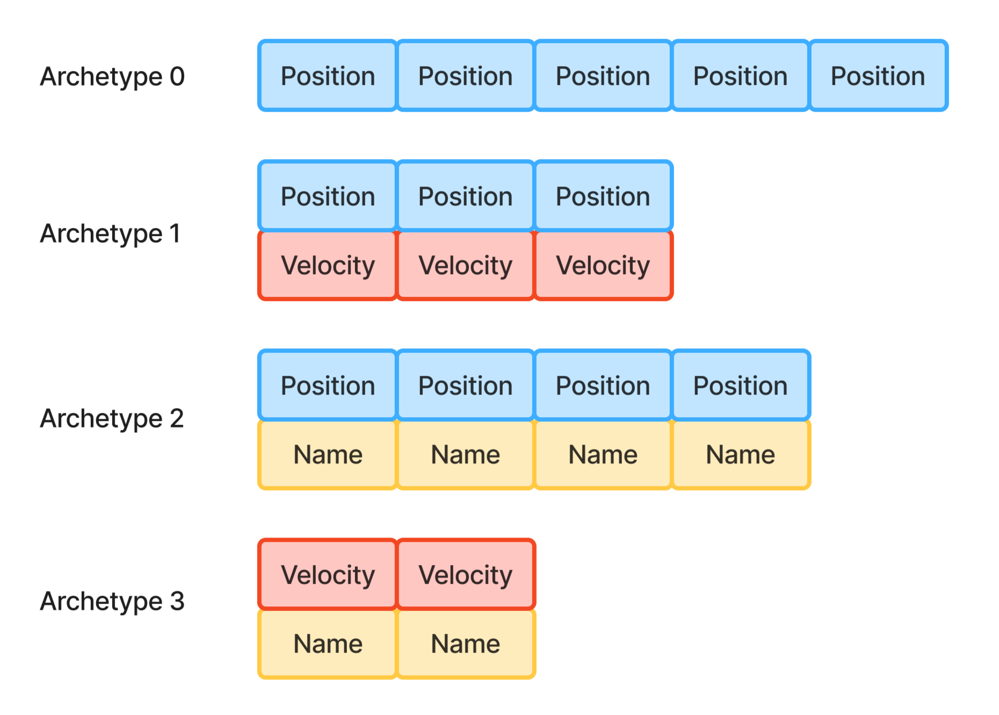

# Archetype

Components of entities which have exactly the same set of components are stored together.

For example,

- an entity with *only* `[Position, Velocity]` components must have stored them inside of an archetype `1`,
- an entity with *only* `[Position, Name]` components must have stored them inside of an archetype `2`.

This means that entity with all of its components should be moved into another archetype
if the combination of such components changes.

Returning to the example above,

- to add `Velocity` component to an entity from the archetype `0`, it must be moved into the archetype `1`,
- to remove `Name` component of an entity from the archetype `2`, it must be moved into the archetype `1`.
