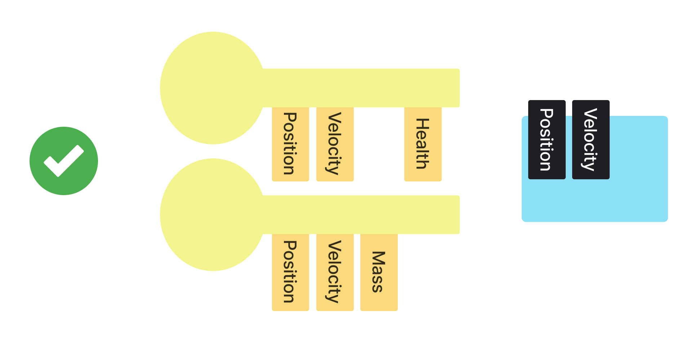
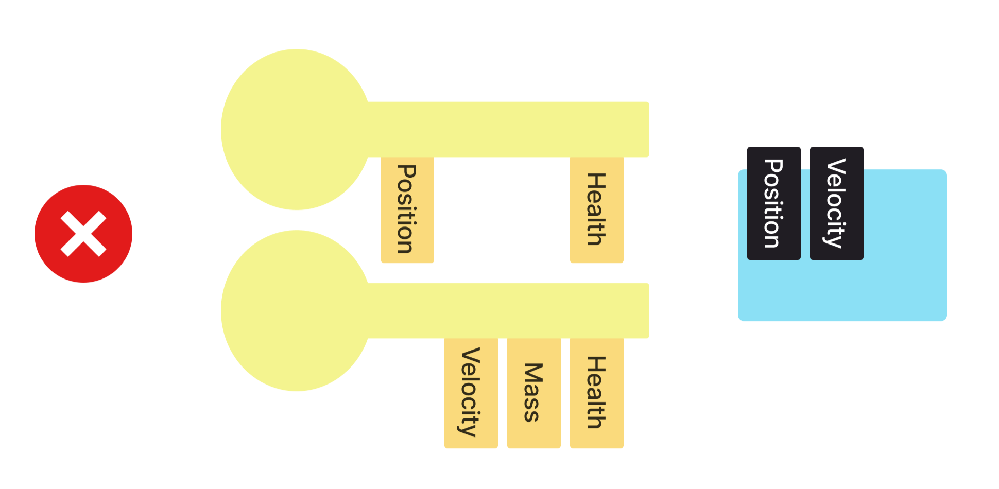

# System

Procedure which acts (or **behaves**) on all [entities](entity.md) with desired combination of [components](component.md).

Usually, it only reads and / or modifies components of entities, although it can add / remove
entities or change their layout (in other words, add / remove some components of such entity).

For example, this system is compatible to these sets of components:

But this one is not:

